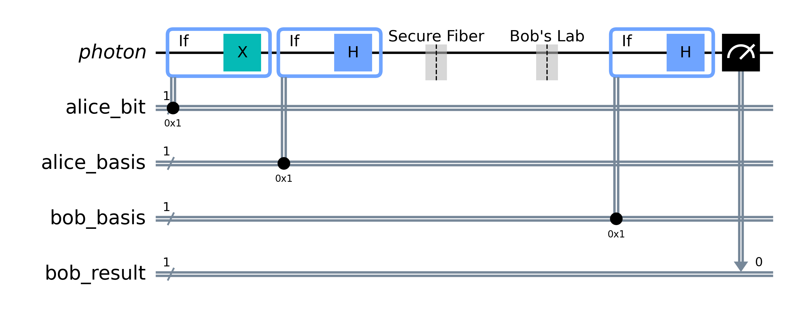
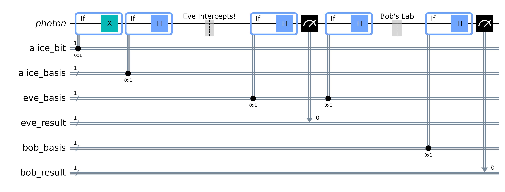

# Q-Net Sim: A QKD & BB84 Simulator


## 📖 Overview

**Quantum Key Distribution (QKD)** offers unconditionally secure communication guaranteed by the laws of physics. However, most educational simulators are not easily accessible or treat QKD as an isolated physics experiment, ignoring the realities of physical network infrastructure and hardware vulnerabilities.

**Q-Net Sim** is a Full-Stack BB84 Simulator that demonstrates applied network engineering and advanced hardware exploits. We simulate multi-node environments, real-world laser imperfections, and the advanced protocols required to secure them. 

Recent updates have upgraded the backend to utilize **True Quantum Randomness** and **Dynamic Circuits**, running natively on IBM's high-performance **AerSimulator**.

## 🎯 Core Objectives

- **Simulate Multi-Node Topologies:** Move beyond textbook point-to-point examples to model realistic, multi-hop quantum network routing and classical channel synchronization.
- **Model Physical-Layer Noise:** Emulate actual hardware constraints, including laser imperfections (e.g., multi-photon emission rates).
- **Execute Advanced QKD Exploits:** Actively simulate realistic eavesdropping vectors like Intercept-Resend and Photon-Number-Splitting (PNS) attacks.
- **Native IBM AerSimulator Backend:** Replace classical pseudo-random number generators (PRNGs) with `qiskit-aer`. The simulation leverages dynamic quantum circuits for high-fidelity measurement logic and true quantum randomness.

## ✨ Key Features
Unlike basic theoretical simulators, Q-Net Sim bridges the gap to practical application:

* **True Quantum RNG:** Ditched classical pseudo-randomness! Alice and Bob's bits and basis choices are now generated by true quantum superposition using Hadamard gates and measurements.
* **Dynamic Circuits (Qiskit 1.0+):** Utilizes `qc.if_test` to execute conditional quantum gates directly on the simulated hardware, mimicking actual quantum hardware workflows.
  
  

* **Trusted Nodes Routing:** Simulates how QKD spans distances greater than 100km (where quantum coherence fails) by generating separate keys across multiple nodes and utilizing classical XOR handoffs.
* **Photon Number Splitting (PNS) Attacks:** Models real-world hardware flaws where lasers emit multi-photon pulses, allowing Eve to siphon duplicate photons without collapsing the wave function or spiking the Quantum Bit Error Rate (QBER).
* **Intercept & Resend (IR) Attacks:** Physically simulates an unauthorized measurement gate in the quantum channel, demonstrating wave function collapse and the resulting QBER.
  
  

* **Interactive React Dashboard:** A live visual UI to toggle attack vectors, distance parameters, multi-photon error rates, and view real-time QBER probability distributions and animated photon transmissions.

## 🛠️ Technology Stack
* **Quantum Backend:** Python, IBM Qiskit (1.0+), Qiskit-Aer (`AerSimulator`), NumPy
* **API Layer:** Flask, Flask-CORS
* **Frontend:** React, Vite, Lucide React (Icons)

## 🚀 Installation & Setup

### Prerequisites
* Python 3.8+
* Node.js (v18+) and npm

### Backend Setup
1. Navigate to the backend directory:
   ```bash
   cd Q-Net-Sim/backend
   ```
2. Create and activate a virtual environment (optional but recommended):
   ```bash
   python -m venv venv
   .venv\Scripts\Activate # On MacOS or Linux, use `source venv/bin/activate  `
   ```
3. Install the required Python packages:
   ```bash
   pip install -r requirements.txt
   ```
4. Start the Flask server:
   ```bash
   python app.py
   ```
   *The server will run on `http://127.0.0.1:5000`.*

### Frontend Setup
1. Open a new terminal and navigate to the frontend directory:
   ```bash
   cd Q-Net-Sim/frontend
   ```
2. Install the dependencies:
   ```bash
   npm install
   ```
3. Start the Vite development server:
   ```bash
   npm run dev
   ```
   *The app will usually be available at `http://localhost:5173`.*

## 🎮 Usage Guide
1.  **Point-to-Point (BB84):** Select the number of photons and simulation speed. Toggle "Simulate Eavesdropper" to explore different attacks (IR vs PNS). Watch the live transmission and check the transmission log to see how sifting drops mismatched bases and how Eve's presence corrupts the final secret key.
2.  **Trusted Nodes Relay:** Configure the network to use 1 or 2 intermediate nodes. Choose a compromised link to see how an attacker intercepts the quantum channel.

## Demo Video
<video src="./frontend/public/test.mp4" width="600" controls></video>